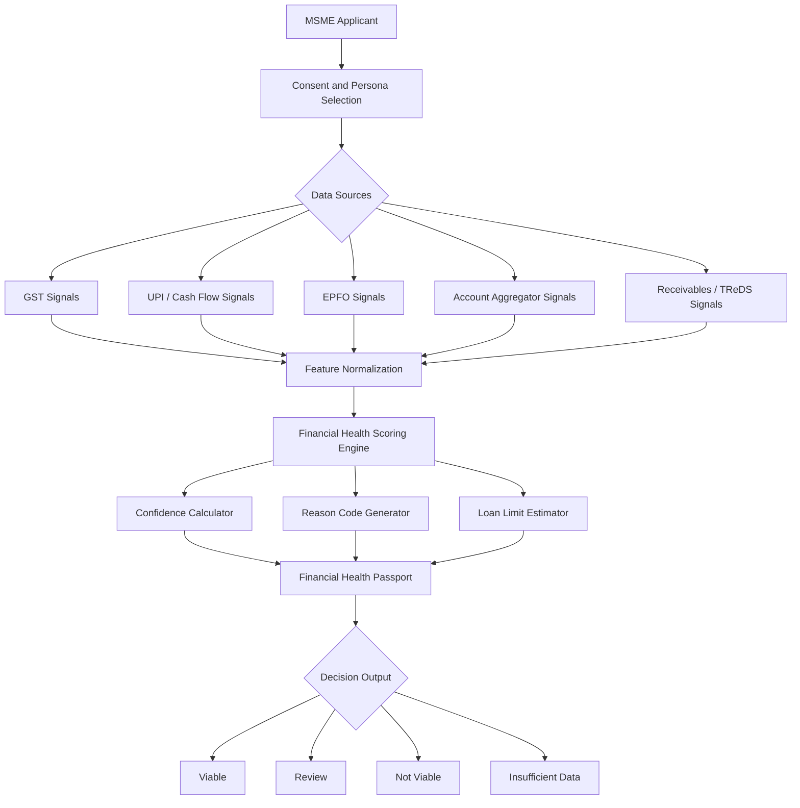
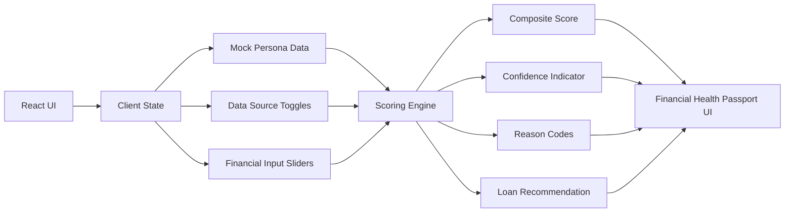

# MSME Financial Health Passport

An interactive prototype for **IDBI Innovate 2026 - Track 03: Financial Health Score**.

Live prototype: https://msme-health-passport.ajsaxena2377.chatgpt.site/index.html  
Repository: https://github.com/Jayant-kernel/idbi-msme-health-passport

## One-Line Pitch

MSME Financial Health Passport converts fragmented alternate data into a living, explainable, viability-based credit passport for MSMEs that may not have traditional collateral or complete bureau history.

## Problem

Many Indian MSMEs are commercially active but remain difficult to underwrite because their financial signals are scattered across systems:

- GST filings show turnover and compliance.
- UPI and bank statements show real cash movement.
- EPFO indicates workforce and salary discipline.
- Account Aggregator data may be incomplete or unavailable.
- Receivables may explain why cash flow appears irregular.
- New-to-credit borrowers may have `NH` bureau status, which should not automatically mean high risk.

The result is a gap between business viability and bank-ready credit assessment.

## Unique Idea

Instead of building another one-time credit score, this prototype introduces a **Living MSME Financial Health Passport**.

The passport is:

- **Living**: it can update as GST, UPI, AA, EPFO, and receivable data changes.
- **Partial-data tolerant**: if Account Aggregator or another source is unavailable, the model still runs and lowers confidence instead of failing.
- **No-history neutral**: `NH` bureau status is treated as neutral, not as a negative reason.
- **Receivables-aware**: verified invoices and buyer quality can explain lumpy cash flow.
- **Explainable**: the output includes reason codes, not just a score.
- **Actionable**: it recommends a loan range or marks the case as not viable with next steps.

## What The Prototype Demonstrates

Judges can:

- Switch between three MSME personas:
  - Kirana Store
  - Garment Manufacturer
  - First-time Borrower
- Toggle five data sources:
  - GST
  - UPI
  - EPFO
  - Account Aggregator
  - Receivables / TReDS
- Adjust underlying financial data using sliders.
- Watch the composite score, confidence, reason codes, and loan recommendation update live.
- Click **Stress case** to see a clear **NOT VIABLE** outcome.

## Demo Flow

1. Open the live prototype.
2. Start with the default Kirana Store persona.
3. Toggle off Account Aggregator to show partial-data handling.
4. Toggle off Receivables / TReDS to show reduced confidence.
5. Click **Stress case**.
6. The system shows:
   - `NOT VIABLE` stamp
   - `No safe limit`
   - reason codes explaining weak repayment capacity and missing supporting evidence
7. Click **Reset entries** to return to the base persona.

## System Flowchart



## Scoring Model

The prototype computes a composite score from six visible sub-scores:

| Dimension | What It Measures |
| --- | --- |
| Cash-flow stability | UPI receipts, bank-flow stability, inferred surplus |
| Revenue authenticity | GST/UPI consistency and revenue trend |
| Compliance reliability | GST delay, EPFO discipline, identity/compliance signals |
| Repayment capacity | Monthly surplus after existing EMI obligations |
| Receivables strength | Pending receivables, buyer quality, invoice-backed support |
| Risk controls | Source coverage, debt burden, missing evidence, stress signals |

The decision stamp is based on score, confidence, repayment capacity, and source coverage:

- **VIABLE**: strong score and strong confidence.
- **REVIEW**: moderate score or partial evidence.
- **NOT VIABLE**: enough data exists, but debt burden/repayment capacity is unsafe.
- **INSUFFICIENT DATA**: too little evidence to assess safely.

## Implementation Plan

### Phase 1: Prototype UI

- Build a responsive React + Vite application.
- Create the passbook/ledger visual system.
- Add three predefined MSME personas.
- Add source toggles and financial sliders.
- Display composite score, sub-scores, confidence, and loan recommendation.

### Phase 2: Explainable Scoring

- Convert raw persona inputs into normalized sub-scores.
- Add source-weighted confidence calculation.
- Add reason-code generation based on active data and risk factors.
- Add no-history-neutral logic for `NH` bureau status.
- Add partial-data behavior for failed or missing AA/GST/receivable sources.

### Phase 3: Stress and Edge Cases

- Add all-sources-off handling as `INSUFFICIENT DATA`.
- Add **Stress case** preset to demonstrate `NOT VIABLE`.
- Ensure the system never crashes on partial or missing data.
- Validate desktop and mobile layouts.

### Phase 4: Future Production Path

- Replace mock persona data with sandbox APIs.
- Connect GST, AA, UPI, EPFO, and TReDS/receivable data sources.
- Add model governance, audit logs, and consent tracking.
- Add bank officer review workflow.
- Add portfolio-level monitoring for MSME applicants.

## Prototype Architecture



## Why This Is Different

Most fintech demos show either a chatbot or a single credit score. This prototype focuses on the underwriting moment a bank officer actually needs:

- What data is available?
- How reliable is it?
- What changed when a source was removed?
- Why is a borrower viable, review-worthy, or not viable?
- What limit can be safely recommended?

The design also avoids the usual generic fintech dashboard look. It is intentionally inspired by an Indian bank passbook/ledger, with ruled paper, typewriter-like numerals, and bank-stamp decision states.

## Tech Stack

- React
- Vite
- Plain CSS
- Lucide React icons
- Client-side mock scoring engine
- No backend required for prototype stage

## Run Locally

```bash
npm install
npm run dev
```

Production build:

```bash
npm run build
```

Preview build:

```bash
npm run preview
```

## Deployment

Recommended deployment target: **Vercel**

Use these settings:

| Setting | Value |
| --- | --- |
| Framework Preset | Vite |
| Build Command | `npm run build` |
| Output Directory | `dist` |
| Install Command | `npm install` |

## Submission Notes

This prototype is designed for a 2-3 minute hackathon judge walkthrough. The fastest evaluation path is:

1. Open the app.
2. Toggle data sources.
3. Observe score and confidence changes.
4. Click **Stress case**.
5. Read the reason codes and loan recommendation.

The core value is not only scoring. The core value is **explainable, partial-data-aware MSME viability assessment** for collateral-light lending.
